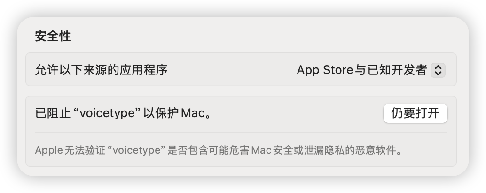
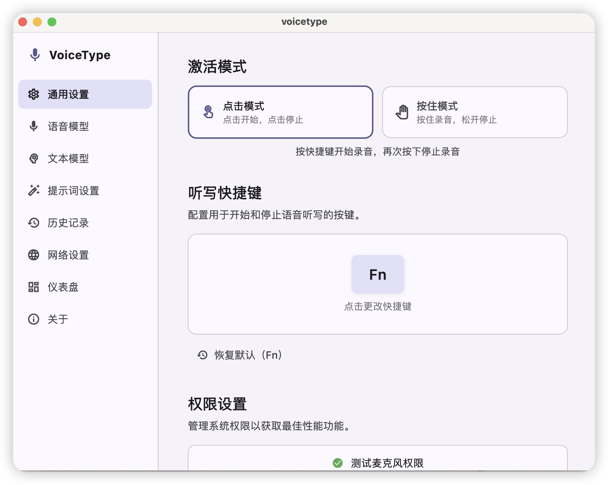
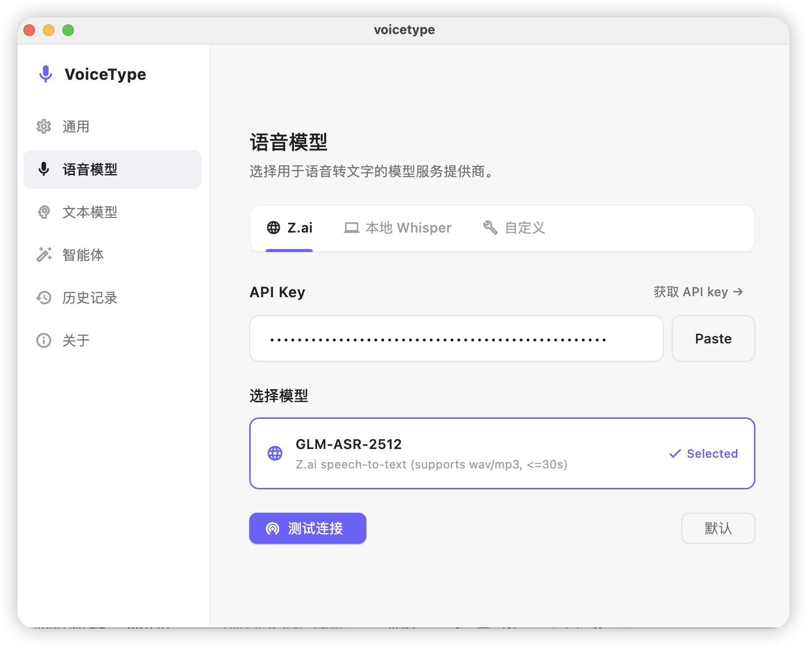
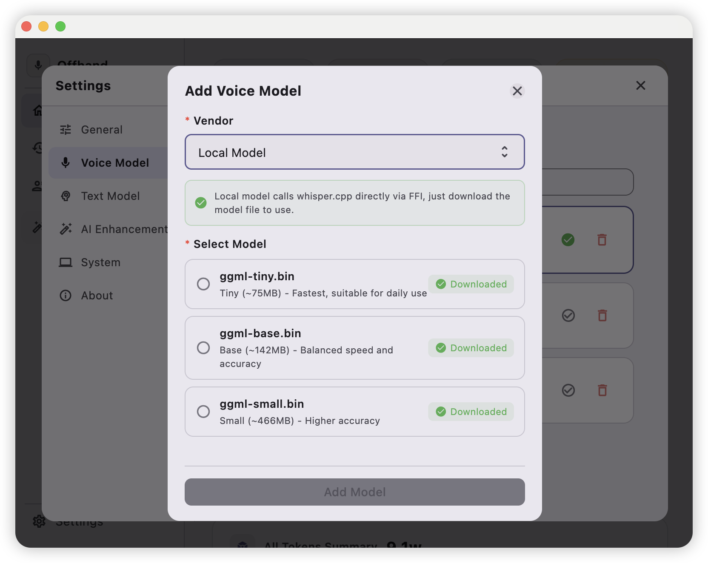
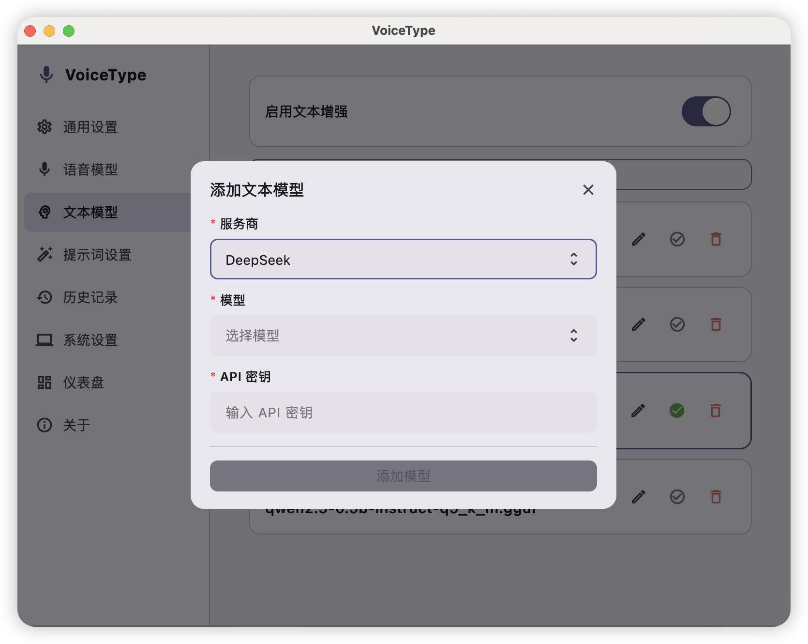
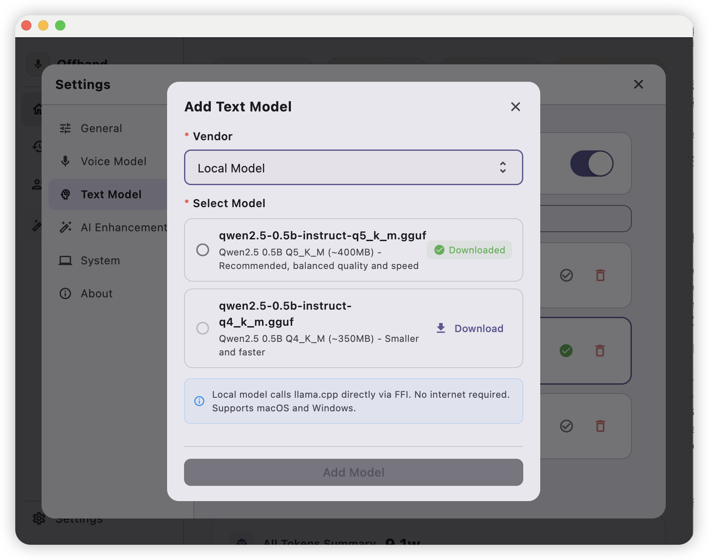

# voicetype

[中文](README.zh-CN.md) | [English](README.md)

This is a voice-to-text input application. After you configure a speech recognition model, it can convert your voice into text and automatically insert the result at the current cursor position of the active application.

## Run in debug mode

### macOS
```
flutter run -d macos
```

### Windows
```
flutter run -d windows
```

## Build installers

If you want to build on your own machine, use the commands below. If you just want to download and use it directly, check [Releases](https://github.com/tyro668/voicetype/releases).

**Note:** On macOS, you need to allow this app in Privacy & Security before launching it. Example:


### macOS build
```
flutter build macos --release
```

### Windows build
```
flutter build windows --release
```

## One-click build scripts

macOS (DMG):

```
./scripts/build-macos.sh
```

Windows (EXE):

```
powershell -ExecutionPolicy Bypass -File scripts/build-windows.ps1
```

## Configure speech model

Using GLM speech model is recommended. Visit [Zhipu](https://bigmodel.cn/usercenter), top up your account, create an API key, and configure it in the app.

| Property | Value |
|-----|-----|
| Endpoint URL | https://open.bigmodel.cn/api/paas/v4 |
| Model Name | GLM-ASR-2512 |

You can also use Alibaba Cloud DashScope speech model (OpenAI-compatible API mode).

| Property | Value |
|-----|-----|
| Endpoint URL | https://dashscope.aliyuncs.com/compatible-mode/v1 |
| Model Name | qwen3-asr-flash |

## Configure text model (optional)

Any OpenAI-compatible service can be used.

| Property | Value |
|-----|-----|
| Endpoint URL | https://open.bigmodel.cn/api/paas/v4 |
| Model Name | GLM-4.7 |

## UI

### General settings


### Speech model settings

Used to configure speech-to-text models. There are online models (better recognition quality, supports dialects) and local models (for testing only).

#### Online speech recognition model (recommended)


#### Local speech recognition model (testing)


### Text model settings

Used to refine colloquial sentences into smoother text. There are online models (better text optimization) and local models (for testing only, lower quality).

#### Online text enhancement model (recommended)


#### Local text enhancement model (testing)


Recording effect

